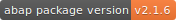
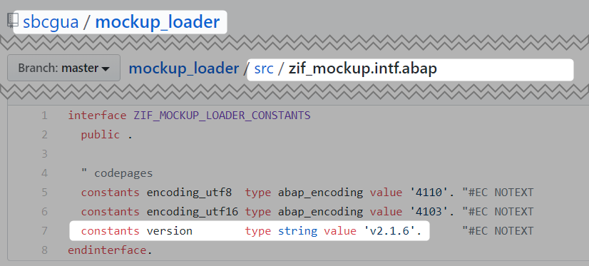

<!-- markdownlint-disable MD041 -->
[](https://snyk.io/test/github/sbcgua/abap-package-version-shield?targetFile=package.json)


# ABAP package version shield

**CHANGE OF SERVICE URL**: Mid January 2025 the original URL `shield.abap.space` became offline due to lack of funding for the domain name. I'm looking for ideas how to fund it properly (40-50 USD per year), please post to [the issue](https://github.com/sbcgua/abap-package-version-shield/issues/191) if you have ideas how to resolve this.

Currently the service is available at new url `abap-version-shield.sbcg.com.ua` (see below) and also a mirror at [tools.abappm.com](https://github.com/abapPM/tools.abappm.com/blob/main/README.md#abap-package-version-badge).

## Usage

There is an amazing service [shields.io](https://shields.io/) that produces github status badges. In particular, it can retrieve shield configuration from another API. This piece of code implements such API endpoint for extracting abap package version.



The service is available at `abap-version-shield.sbcg.com.ua` domain. In order to add a badge to your repository add the following line at the top of your root readme file.

```text

```

where:

- $TYPE = 'github' (only this for now)
- $OWNER = your github user name
- $REPO = you repo name
- $PATH = path to abap file with version constant
- $CONSTANT_NAME = constant name to search version in (optional, "version" by default)

For example: [`https://img.shields.io/endpoint?url=https://abap-version-shield.sbcg.com.ua/version-shield-json/github/sbcgua/mockup_loader/src/zif_mockup_loader.intf.abap/version`](https://img.shields.io/endpoint?url=https://abap-version-shield.sbcg.com.ua/version-shield-json/github/sbcgua/mockup_loader/src/zif_mockup_loader.intf.abap/version)



### Notes

- The version is supposed to be in [semantic version](https://semver.org/) format - e.g. `'X.Y.Z'` or `'vX.Y.Z'` or `'vX.Y.Z-beta'` - the version string is validated and a wrongly formatted one will not pass (e.g. `'X.Y'` is not valid)
- if `$PATH` = `.apack-manifest.xml` the version is read directly from that file.
- apack parsing also supports displaying dependency version (see [issue #1](https://github.com/sbcgua/abap-package-version-shield/issues/1)). `'...apack-manifest.xml/dependencies/<group_id>/<artifact_id>'`.
- namespaced filenames and structured constants (`begin of...`) are also supported

### Badge customizing

Shields.io allows to override some of parameters e.g. label and color - see more in [their documentation](https://shields.io/). For example: `https://img.shields.io/endpoint?url=...&label=version&color=red` to display the shield in red and with shorter "version" label instead of "abap package version".

## Badge constructor

Interactive badge constructor is available at [this repository github page](https://sbcgua.github.io/abap-package-version-shield#badge-constructor)
